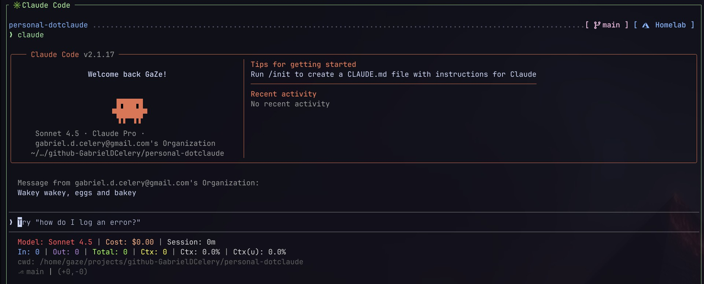

# personal-dotclaude

Shared Claude Code configuration for personal repositories. Provides default project context, custom agents, and standardized rules for common tasks like README generation.

> [!NOTE]
> Intentionally separated from [dotfiles](https://github.com/GabrielDCelery/personal-dotfiles) and [dev environment setup](https://github.com/GabrielDCelery/personal-dev-environment-quickstart)



## Quick Start

```sh
git clone git@github.com:GabrielDCelery/personal-dotclaude.git
cd personal-dotclaude
mise run bootstrap-claude-code
mise run bootstrap-copilot
```

## Architecture

- **Type**: Configuration repository
- **Task Runner**: mise
- **MCP Servers**: Context7 (documentation lookup), Atlassian Confluence & Jira (via Atlassian's official Rovo MCP server)
- **Custom Agents**: DocsExplorer, Context7DocsExplorer
- **Custom Rules**: README generation guidelines

## What's Included

```
.dotclaude/
├── CLAUDE.md                        # Default project context
├── settings.json                    # Claude Code settings
├── mcp.json                         # Shared MCP server config (Claude Code + Copilot)
├── agents/
│   ├── DocsExplorer.md             # Documentation lookup (Context7 + web)
│   └── Context7DocsExplorer.md     # Documentation lookup (Context7 only)
├── rules/
│   └── readme-styles.md            # README generation guidelines
└── skills/
    └── branch-diff-review/         # Portable skill (Claude Code + Copilot Agent Skills)
```

## Configuration

| Variable                    | Description                                                                  | Required                  | Default |
| --------------------------- | ---------------------------------------------------------------------------- | ------------------------- | ------- |
| CONTEXT7_API_KEY            | API key for Context7 MCP server                                              | Yes                       | None    |
| WORK_CONFLUENCE_AUTH_HEADER | `Basic <base64(email:token)>` header for the Atlassian Confluence MCP server | For Atlassian MCP servers | None    |
| WORK_JIRA_AUTH_HEADER       | `Basic <base64(email:token)>` header for the Atlassian Jira MCP server       | For Atlassian MCP servers | None    |

Secrets are stored in `.env` locally, except the `WORK_*` variables below.

### Atlassian MCP auth

The Atlassian MCP servers (`work-atlassian-confluence`, `work-atlassian-jira`) authenticate with [scoped Atlassian API tokens](https://id.atlassian.com/manage-profile/security/api-tokens) ("Create API token with scopes", not the classic kind) over HTTP Basic Auth. A token only grants tools for the product it was scoped to, so Confluence and Jira need separate tokens.

These are machine-specific work credentials, so they're never written into this repo — `WORK_CONFLUENCE_AUTH_HEADER`/`WORK_JIRA_AUTH_HEADER` are expected to already be set in the environment before running `bootstrap-claude-code` (its `bootstrap-claude-code:atlassian-confluence`/`bootstrap-claude-code:atlassian-jira` subtasks skip with a log message if they're unset, rather than failing). On machines that need Atlassian access, they're populated by `.zshrc.work` in [personal-dotfiles](https://github.com/GabrielDCelery/personal-dotfiles), which reads from `pass`:

```sh
pass insert work/email
pass insert work/atlassian/confluence-api-token
pass insert work/atlassian/jira-api-token
```

> [!NOTE]
> Copilot CLI's `${VAR}` expansion inside `mcp-config.json` headers has been flaky across versions ([github/copilot-cli#1403](https://github.com/github/copilot-cli/issues/1403)). If the symlinked config doesn't pick up the header, that's the first thing to check.

## Setup

Prerequisites: [Claude Code](https://code.claude.com/docs/en/setup) installed with `~/.claude` directory initialized.

### Option A: User-wide setup (recommended)

Symlinks configuration to `~/.claude` and/or `~/.copilot`:

```sh
mise run bootstrap-claude-code   # symlinks to ~/.claude, registers Context7 + Atlassian MCP servers
mise run bootstrap-copilot       # symlinks to ~/.copilot
```

Each is a parent task made up of independent subtasks (`mise tasks` to see the tree, e.g. `bootstrap-claude-code:context7`). The Context7 and Atlassian subtasks each check for their own required env var and skip with a log message — rather than failing — if it's not set, so running `bootstrap-claude-code` on a personal machine without `WORK_CONFLUENCE_AUTH_HEADER`/`WORK_JIRA_AUTH_HEADER` just skips those two servers.

> [!NOTE]
> `bootstrap-claude-code` and `bootstrap-copilot` are independent — run either or both depending on which tool(s) you use. They share the same underlying files: Agent Skills (`SKILL.md`) are a shared open format and the MCP config schema is compatible, so `.dotclaude/skills` and `.dotclaude/mcp.json` work unmodified in both Claude Code and Copilot.

> [!WARNING]
> Don't symlink the entire `.dotclaude` directory to `~/.claude` - the home directory contains Claude Code's data files.

### Option B: Per-project setup

Symlinks configuration to a specific project:

```sh
ln -s /path/to/personal-dotclaude/.dotclaude /path/to/your-project/.claude
echo '.claude' >> /path/to/your-project/.gitignore
```

## Usage

Start Claude Code and reference the custom rules:

```sh
claude
```

Example prompts:

```
Can you help me with the README according to our standards?
Get docs for React and TypeScript
```

## Adding Project-Specific Context

Create a `CLAUDE.md` at the project root for additional context:

```
your-project/
├── CLAUDE.md          # Project-specific context
├── .claude -> ...     # Symlinked from personal-dotclaude
└── src/
```

Claude Code merges both the global and project-specific context.

## Updates

```sh
cd personal-dotclaude
git pull
```

Symlinks pick up changes automatically.

---

> [!NOTE]
> Why `.dotclaude` instead of `.claude`? To avoid naming conflicts with Claude Code's default directory.
